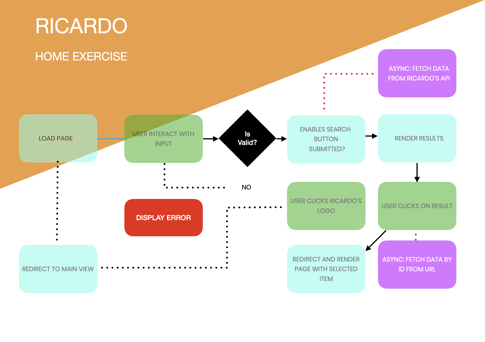

# RICARDO HOME EXERCISE

## INDEX
* INTRODUCTION
* SCRIPTS
* DIFERENT BRANCHES & ROLES
* FLOWCHART
* APP DESCRIPTION

 

________

## INTRODUCTION
I am really happy working on this small Ricardo version. I hope you find the code readable and well structured. 
 
At first I thouth about the features that I could implement in this small version, finally I have decided to first focus on the minimal requirements and fullfilth the minimal viable product. After that, release my imagination and depending on the available time implement the new features.

 

## SCRIPTS 
### `npm start`

Runs the app in the development mode.\
Open [http://localhost:3000](http://localhost:3000) to view it in the browser.

The page will reload if you make edits.\
You will also see any lint errors in the console.

### `npm test`

Launches the test runner in the interactive watch mode.\
See the section about [running tests](https://facebook.github.io/create-react-app/docs/running-tests) for more information.

### `npm run build`

Builds the app for production to the `build` folder.\
It correctly bundles React in production mode and optimizes the build for the best performance.

The build is minified and the filenames include the hashes.\
Your app is ready to be deployed!

See the section about [deployment](https://facebook.github.io/create-react-app/docs/deployment) for more information.

## DIFERENT BRANCHES & ROLES

Probably it is going to be more than a couple of branches
 
 
WILL UPDATE LATER

 

## FLOWCHART

I like to do this kind of things.  

If you want you can visit my workspace [HOME-EXERCISE-WORKSPACE](https://trello.com/b/24XwVoJJ/home-exercise-ricardo)

 

## APP DESCRIPTION

(UPDATE LATER)

